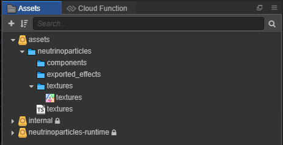
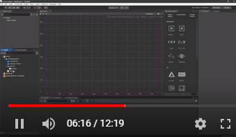

# NeutrinoParticles Cocos

This extension package allows you to use [NeutrinoParticles](https://neutrinoparticles.com/) effects in the [Cocos Creator](https://www.cocos.com/) engine.

## Version of Cocos
This package works well with Cocos Creator 2.4.x.

> There was a bug in Cocos Creator related to materials. It was fixed by [this](https://github.com/cocos-creator/engine/pull/7934) pull request and should be merged into 2.4.4 branch, but it didn't happen for a some reason. The bug prevents using World Parent for components ([see more](tutorials/fundamentals/fundamentals.md) about World Parent). We hope to see this fix in 2.4.5. Before that, you should merge the fix into your engine manually.

## Supported platforms
All platforms are supported.

## If you have an issue or request ##

Please, add it to the [Issues](https://gitlab.com/neutrinoparticles/neutrinoparticles-cocos/-/issues) page.

## Installation
Put this repository into your project directory in `packages/neutrinoparticles` subfolder. You can make it in any suitable way, like:
* Clone with git _(run from project's root)_:
    ```
    git clone git@gitlab.com:neutrinoparticles/neutrinoparticles-cocos.git packages/neutrinoparticles
    ```
* Submodule with git _(run from project's root)_:
    ```
    git submodule add git@gitlab.com:neutrinoparticles/neutrinoparticles-cocos.git packages/neutrinoparticles
    ```
* Download .zip archive of the repository and put it in the folder above.

After package is there, you need to restart the Cocos Creator and open the project again. 

> 2.4.x version of the Cocos Creator works with many issues related to automatic scripts updating. If you don't see a script or a texture which should be there, please restart the Cocos.

You will see new assets package called `neutrinoparticles-runtime`:



This package contains all necessary scripts and materials to start using NeutrinoParticles.

## Quick Usage

[](https://youtu.be/ARloj01n9-I)

You can also check the [text version](tutorials/quick_usage/quick_usage.md).

## Tutorials

Consider to go through the tutorials in appearance order, so you will learn most important things first. 

* [Fundamentals.](tutorials/fundamentals/fundamentals.md) Which covers following:
    * World Parent
    * Scale
    * Sprite Atlases
    * Textures Trimming
    * Texture Prefix Path
* [Working with effects from scripts](tutorials/working_from_scripts/working_from_scripts.md)
    * Create effect
    * Destroy when emtpy
    * Create effect component by it's name
    * Syntax highlighting and members suggestions
* [Working with pause](tutorials/working_with_pause/working_with_pause.md)
* [Change effect properties from scripts](tutorials/effect_properties/effect_properties.md)

## 🔥 Tips & Tricks 🔥

### Disable trimming for textures (sprites) used in effects

NeutrinoParticles doesn't support trimming for textures. And in `assets/neutrinoparticles/textures` folder trimming is disabled automatically. So, disable it as well if you use custom sprite atlases or in any other case when textures are placed in other folders.

### Don't use identical names for effects.

Cocos Creator can't handle scripts with identical names well. So, even if effects are in different folder, please, give them different names.

### Use sprite atlases for effects.

It is done by default. Don't delete auto-atlas in `assets/neutrinoparticles/textures`, or use custom sprite atlases. It will optimize rendering. It's better to use the same sprite atlas for all effects in the scene. And group effects to be rendered in row, without interleaving by other sprites.

## Contribution

Any kind of help in developing this extension package is highly appreciated.