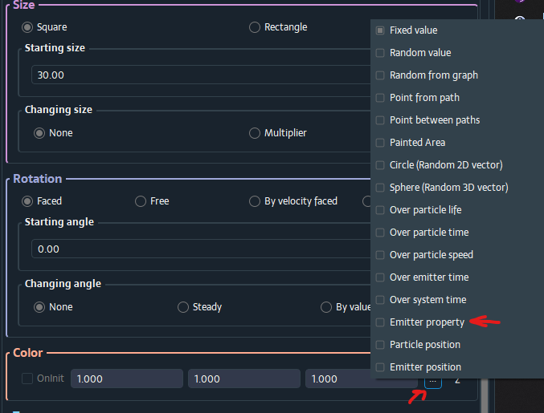
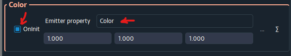
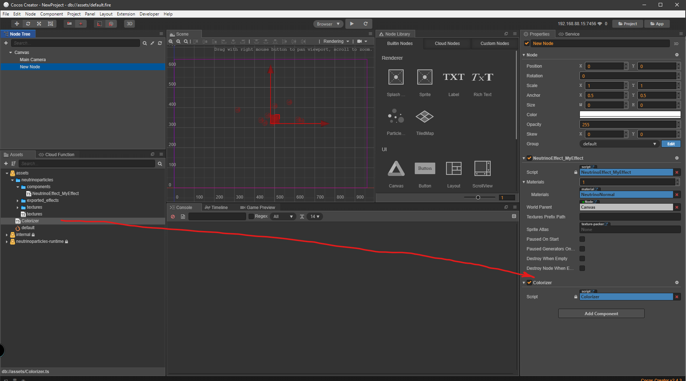

# Change effect properties from scripts

It is possible to change some properties in the effect from scripts. You manually specify in the NP Editor which properties you want to expose.

Let's continue with effect from [Quick Usage](../quick_usage/quick_usage.md) tutorial.

And let's suppose you want to change bubbles color in run time.

In the NP Editor in the `Emitter Guide` window find `Color` section and change value type from `Fixed` to `Emitter property`:



Then, specify `Color` name for the emitter property and set `OnInit` check box:



`Color` will be the name of the property which you use when change from scripts. And `OnInit` means Save On Particle Initialization, which enables saving of the current property value inside a particle. If `OnInit` is disabled and you change the property value, all active particles of the emitter will change their color. If `OnInit` is enabled, only newly emitted particles will have changed color.

Now, re-export the effect by pressing `(E)` button on it in project window as you did in Quick Usage tutorial. And switch to Cocos Creator window. The effect should be reloaded.

Let's create a script with name `Colorizer` (or any on your choise) to change the color of the effect. I suppose you know how to create a script in the Cocos. I will use TypeScript.

Here is a content of the script:
```javascript
import NeutrinoEffect from 'NeutrinoEffect_MyEffect';

const {ccclass, executeInEditMode} = cc._decorator;

@ccclass
@executeInEditMode // To see how it works in the editor
export default class NewClass extends cc.Component {

    start() {
		const effect = this.node.getComponent(NeutrinoEffect);
		if (effect) {
			effect.setPropertyInAllEmitters(
                'Color',                // Name of the property
                new cc.Vec3(1, 0, 0)    // cc.Vec3(R, G, B) - red color
            );
		}
	}
}

```

In the script above we get the effect component from the node and set `Color` property (which actually is 3D vector) to `{1, 0, 0}`. This value will be interpreted as `{R, G, B}` by NeutrinoParticles and we shall get red color of particles.

Drag the `Colorizer` component from assets to the node with the effect, and you should see red bubbles:



In the similar way you can change any exposed by NP Editor property in run time. Possible types for value are: `number`, `cc.Vec2`, `cc.Vec3`.