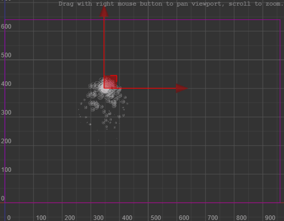
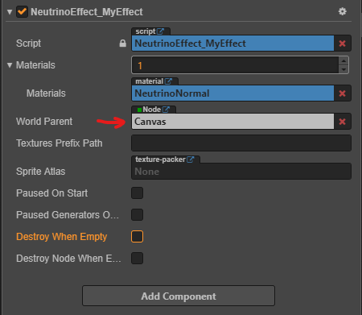
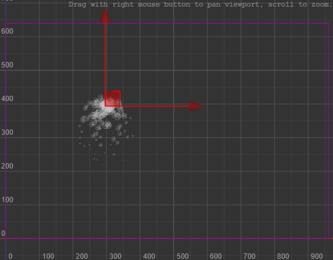
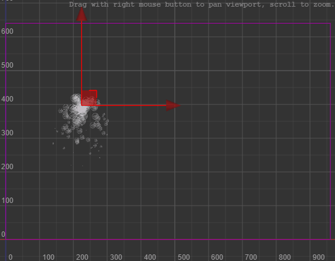
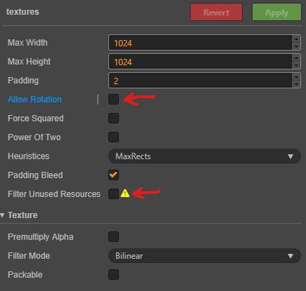
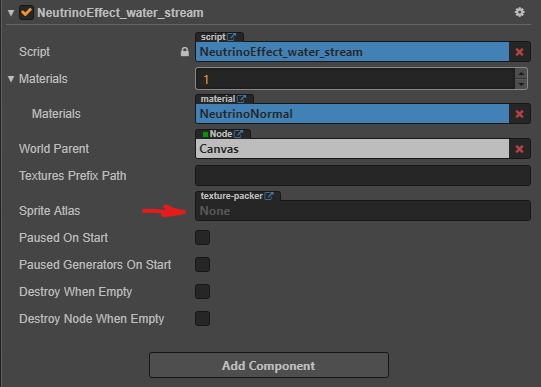
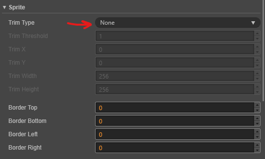
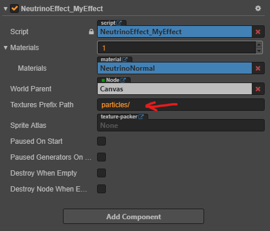

# Fundamentals: World Parent, Scale, Sprite Atlases, Textures Trimming and Texture Prefix Path

[Go back to Main Page](../..)

## Introduction

[NeutrinoParticles](https://neutrinoparticles.com/) is a project which allows to use particle effects in form of a source code in projects written in JavaScript (and other platforms). You make an effect in generic way in the NeutrinoParticles Editor. Then export the effect to JavaScript source code. For each effect you have one file which describes a class with all necessary algorithms and information to simulate and render this effect. The class doesn't use any platform-specific functions and on each frame of simulation gives geometry (pure vertices and indices arrays), which needs to be handled by engine's integration library. It should fill this geometry into WebGL buffers, use correct materials, shaders and render the effect in the most optimal way for the engine. That's exactly what NeutrinoParticles Cocos library does. It integrates NeutrinoParticles into Cocos Creator.

## World Parent

Effects in NeutrinoParticles emit particles to the global space (or world space). This means, when a particle is emitted, it is simulated without respect to the effect's position. Usually, it works exactly in the way you expect. You can drag the effect and emitted particles live by themselves:

But sometimes, you need to control the world space and move or scale all particles at once. In this case you can specify `World Parent` node for the effect's component:

By default, it is a node called `Canvas` in the root of the scene. If there is no such node, it will be empty, which means there is no World Parent node and all particles are emitted in the world space of the scene.

> `World Parent` node can be accepted by the component only if it is one of parent nodes.

> To change `World Parent` drag a node to the property field.

So, when `Canvas` is the World Parent, all particles are simulated in the local space of the `Canvas`. Let's see what happens when it is moved:

You can also set current node of the effect as `World Parent`. In this case when you move the node, whole effect will be moved as well:

## Scale

> Don't scale a node with effect attached dynamically! It leads to undesired particles shifting.

The best way to use scale is to set it before the effect is simulated or at least there are no emitted particles on the screen. Otherwise, you will see shifting of emitted particles.

## Sprite Atlases

Sprite Atlas (usually called Texture Atlas), is a way to keep all necessary textures baked on several big textures to optimize scene rendering.

For NeutrinoParticles it is highly recommended to use Sprite Atlases as well, and it is done by default. In the `assets/neutrinoparticles/textures` folder you can find `textures` auto-atlas. It will automatically bake all textures inside this folder when you build the application.

You can change settings of this auto-atlas on your own, but there are two of properties which should stay unchanged:

`Allow Rotation` is not supported by NeutrinoParticles so it should be disabled. 

`Filter Unused Resources` should be disabled as well, as the engine doesn't know which textures will be loaded by the effects. It is done dynamically.

You can delete this default auto-atlas. In this case all textures will be loaded and used separately. Rendering will become unoptimized.

It is also possible to use custom texture atlases of any supported by Cocos Creator type. __Just remember to disable rotation and trimming for sprites.__ 

To specify a custom sprite atlas you can use a property in the `NeutrinoComponent` called `Sprite Atlas`:

 You can drag any sprite atlas from assets to the property and `NeutrinoComponent` will try to load all textures from the provided atlas. If a texture is not found on the atlas, the component tries to load it as usual from `assets/neutrinoparticles/textures`.

## Textures Trimming

> NeutrinoParticles doesn't support trimming for textures (or sprites). Consider this when creating custom sprite atlases.

The extension scans `assets/neutrinoparticles/textures` folder recursively and disables trimming for sprites there. See `Trim type` property of a sprite:

Don't try to enable it, as in a couple of seconds it will be back again.

## Textures Prefix Path

When NP Editor exports effects it doesn't save content of textures, it saves only paths to textures relatively to textures root folder specified in NP project. And it is up to engine's integration library to handle textures loading according to their paths.

In current Cocos Creator integration, all assets related to the NeutrinoParticles in the project are stored in `assets/neutrinoparticles`. And textures for the effects are in `assets/neutrinoparticles/textures`. It is a shared forlder between NP project `packages/neutrinoparticles/particles.npproj` and the integration code which loads the textures at runtime. So, when you add a texture in the NP Editor it will be automatically added to the Cocos project.

In this default configuration you don't need any textures prefix, as textures root folder in the NP project and root textures lookup folder for the integration code are the same. Any relative texture path maps perfectly.

However, in case you want to modify default workflow or use custom sprite atlases, you might need to use `Textures Prefix Path`. You can find the property in the `NeutrinoComponent`:

The prefix is added by runtime integration code when loading textures. It can help you re-map textures paths.

