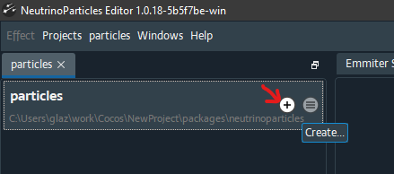
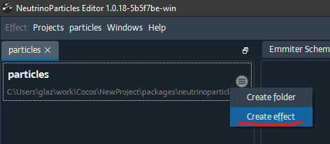
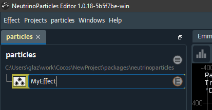
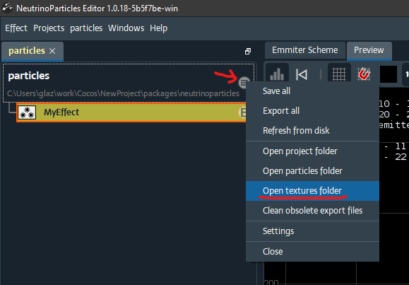
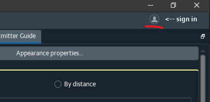
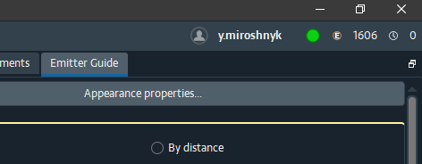
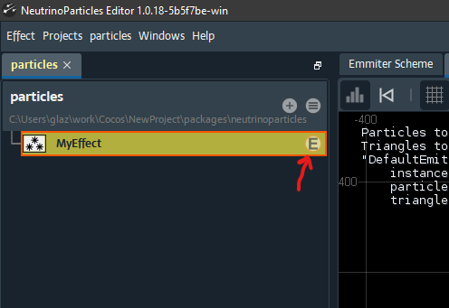
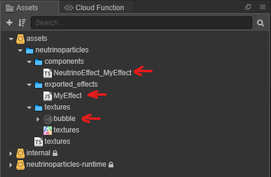
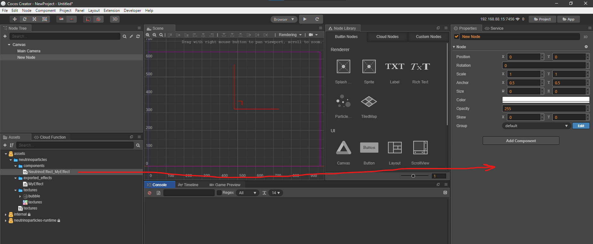
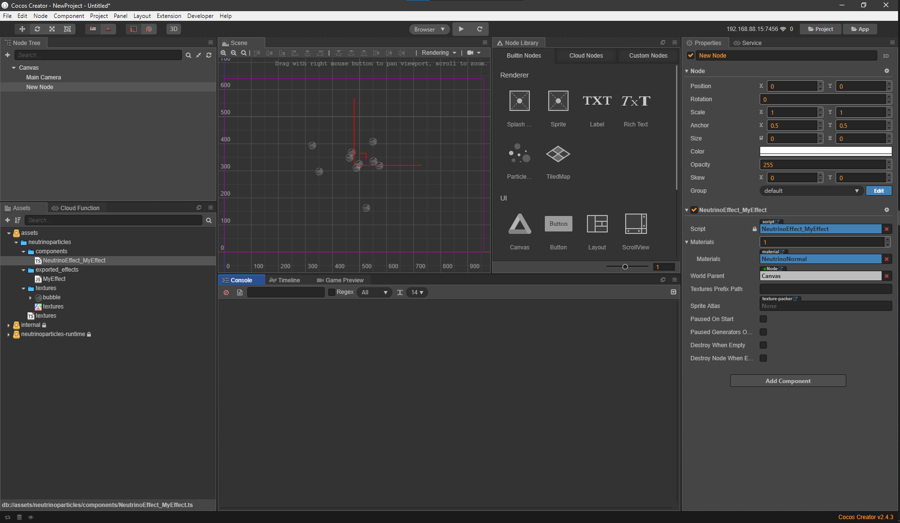

# Quick Usage

## Create an effect

Open `packages/neutrinoparticles/particles.npproj` project in [NeutrinoParticles Editor](https://neutrinoparticles.com/en/downloads). Use `Projects/Open` main menu or a corresponding button on the welcome dialog for that.

By default this project has no effects. So, let's create one:

Type in `MyEffect` name (or any name you prefer) and hit `Enter`:

Now, please find a texture you want to use to assign on particles. Or you can use following bubble sample:

Then open textures folder (which is `assets/resources/particles` by default):

And copy your texture there in any suitable way.

Next, open the Emitter Guide window and press `Appearance properties` button. Then in the `Properties` window change `Texture` property by pressing three dots button and specify your texture in the dialog. After that, you should see particles effect with the texture:

## Export the effect

The next step is exporting the effect to use it in the Cocos. 

To make exports you will need an account at the https://neutrinoparticles.com/ website. Register there and use the same user name and password to log in the NeutrinoParticles Editor. You will find `sign in` button in the top right corner of the editor:

When succeeded, you will see your account info there:

Everything is ready to make export, so press `(E)` button on the effect in the project window:

If everything went well, the `(E)` button will disappear, and when you switch to the Cocos Creator, you will find several new files in your assets:

* `MyEffect` is an exported effect by NeutrinoParticles Editor. You will not directly use this script.
* `NeutrinoEffect_MyEffect` is a render component to attach `MyEffect` to a node in the scene. You can drag this component to a node.
* `bubble` is a texture you copied earlier.

When you changed something in the effect in the NP Editor, you need to re-export it and it will be reloaded by Cocos Creator automatically.

## Add the effect to the scene

Now you are ready to add the effect to the scene. Create a new node and drag `NeutrinoEffect_MyEffect` to it's properties:

And you should see working effect on the scene:

