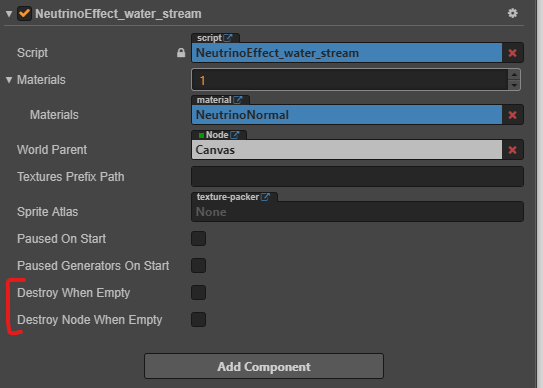

# Working with effects from scripts

Basically, you use NeutrinoParticles effects as usual components. For every exported effect you have generated `NeutrinoEffect_...` component in `assets/neutrinoparticles/components` folder.

>It is a `RenderComponent` and it's only one render component per node allowed by Cocos Creator.

First of all, import the effect component in your script.

For JavaScript and TypeScript:
```javascript
import NeutrinoEffect from 'NeutrinoEffect_water_stream';
```

Or for JavaScript using `require`:

```javascript
const NeutrinoEffect = require('NeutrinoEffect_water_stream');
```

You don't need to specify correct relative path to the component.

## Create effect

To create and attach the component to the node, use:

```javascript
const effect = this.node.addComponent(NeutrinoEffect);
```

By default, the effect is not paused and will start to play immediately when attached to the active node.

And afterwards to access the component, use:

```javascript
const effect = this.node.getComponent(NeutrinoEffect);
// Make some job with component
if (effect) {
    effect.restart();
}
```


## Destroy when empty

There is no such event fired by NeutrinoParticles to find out when the effect is finished to play. The only way is to check if there are no particles left in the effect.

To simplify deleting effect after played, there are two properties introduced:



* `Destroy When Empty` will destroy the component when it is not paused and is out of particles.
* `Destroy Node When Empty` will destory the node of the component when it is not paused and is out of particles.

So the next piece of code is pretty common:
```javascript
const effect = this.node.addComponent(NeutrinoEffect);
effect.destroyWhenEmpty = true;
```

It will add effect component to the node and this component will be deleted when the effect is finished (out of particles).

> Please note, if the effect is infinite and emits particles continuously, there will be no moment when there are no particles. So, it will play until component destroyed manually.

## Create effect component by it's name

If you have effect name in a string variable, like:
```javascript
let effectName = 'NeutrinoEffect_water_stream';
```
you can create it's component using `cc.js.getClassByName` lookup function:
```javascript
const effect = this.node.addComponent(cc.js.getClassByName(effectName));
```
> Keep in mind, that Cocos Creator gives names for classes by their file names.

## Syntax highlighting and members suggestions

You will find you don't get any member suggestions from your editor for `NeutrinoEffect_...` component.

Even if you use correct relative path when importing `NeutrinoEffect_...` component, you will not find it useful, as the component by itself imports it's basic class `NeutrinoComponent` just by the name and not by correct relative path.

It is done because there is no way to correctly import script from extenstion package. So, this issue is to be done yet.

