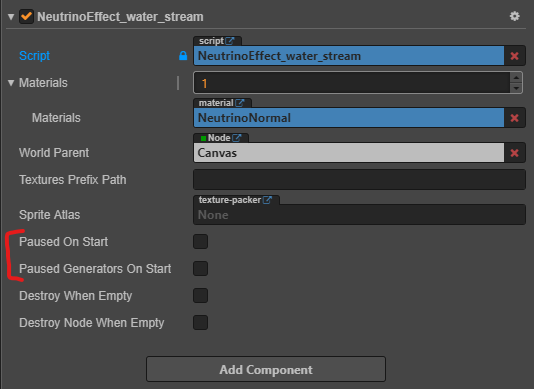

# Working with pause

Sometimes you don't need to start an effect immediately after attaching to a node. Or you might need to pause generating of new particles, or freeze the effect. In this cases you need to use pause.

There are two types of pause:
* Effect pause
* Generators pause

The first one will freeze the effect. Nothing continues simulating until unpaused. The second one will stop generating new particles, but already created continue to simulate until killed.

The effect component has two properties related to pause. These properties intialize pause state on the component startup.

If the effect was paused on startup, the only way to unpause it is from the scripts.

There are several methods in the effect component to work with pause:
* `NeutrinoComponent.pause()` to pause the effect.
* `NeutrinoComponent.unpause()` to unpause the effect.
* `NeutrinoComponent.paused()` to check if the effect paused.
* `NeutrinoComponent.pauseGenerators()` to pause generators of the effect.
* `NeutrinoComponent.unpauseGenerators()` to unpause generators of the effect.
* `NeutrinoComponent.generatorsPaused()` to check if generators of the effect are paused.

